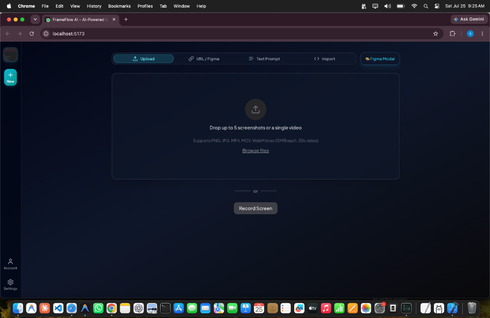
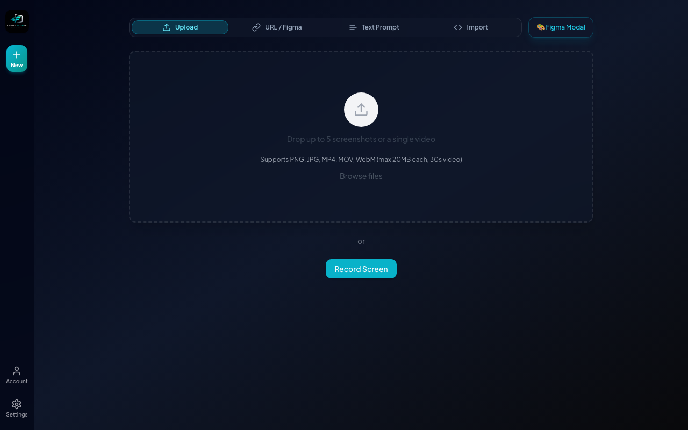

<div align="center">



# ⚡ FrameFlow AI

### **Turn any screenshot, Figma file, website URL, or screen recording into production-ready frontend code — in seconds.**

[](https://opensource.org/licenses/MIT)
[](https://nodejs.org)
[](https://www.python.org)
[](#contributing)
[](https://github.com/aaravkhanal/frameflow-ai)

[Features](#features) • [Demo](#demo) • [Quick Start](#quick-start) • [How It Works](#how-it-works) • [Tech Stack](#tech-stack) • [Roadmap](#roadmap) • [Contributing](#contributing)

</div>

---

## 🚀 What is FrameFlow AI?

**FrameFlow AI** is an AI-powered code generation platform created and engineered by **Aarav Khanal**. It converts visual interfaces, screenshots, Figma design files, website URLs, and screen recordings into clean, responsive, production-ready frontend code.

Powered by a **Multi-Model AI Pipeline & Consensus Engine** (OpenAI, Anthropic Claude, Google Gemini, Replicate), FrameFlow AI analyzes input designs across multiple LLMs to generate high-accuracy code with live previews and multi-file project exports.

---

## 👤 Developer Credit

- **Creator & Lead Engineer**: **Aarav Khanal**
- **Architecture**: Multi-Agent Consensus Framework, Multi-Modal Code Generation Engine, Async JWT Auth Pipeline.

---

## 🎬 Demo

<div align="center">



| Input | Output |
|---|---|
| Screenshots / Figma URLs / Website Links / Screen Recordings | React + Tailwind / Vue / HTML / Bootstrap components with live preview & export |

</div>

---

## 📜 Table of Contents

- [Features](#features)
- [Supported Frameworks](#supported-frameworks)
- [How It Works](#how-it-works)
- [Tech Stack](#tech-stack)
- [Project Structure](#project-structure)
- [Quick Start](#quick-start)
- [Environment Variables](#environment-variables)
- [Authentication](#authentication)
- [Running Tests](#running-tests)
- [FAQ](#faq)
- [Roadmap](#roadmap)
- [Contributing](#contributing)
- [License](#license)

---

## ✨ Features

| Feature | Description |
|---|---|
| 🖼️ **Screenshot → Code** | Convert any UI screenshot into working frontend code |
| 🎨 **Figma Import** | Render and convert Figma design files & nodes directly via Figma API |
| 🌐 **URL → Code** | Point at live websites to capture layout structure & generate code |
| 🎥 **Screen Recording → UI** | Extract dynamic interactive UI components from MP4/WebM video clips |
| 🧩 **Multi-Framework Output** | Generate React, Vue, HTML + Tailwind, HTML + CSS, Bootstrap, and Ionic |
| 🤖 **Multi-Model AI Consensus** | Combines OpenAI, Anthropic Claude, and Google Gemini simultaneously for high accuracy |
| 🖌️ **AI Asset Extraction** | Automatically isolates images, icons, and logos from screenshots |
| 🔐 **Supabase Authentication** | Fast, secure Email & Password login, JWT verification, and protected API routes |
| 🗄️ **PostgreSQL Integration** | Automatically saves UI generations to Supabase with Row-Level Security (RLS) |
| ⚡ **Live Preview & ZIP Export** | Preview components live in desktop/mobile viewports and export as a multi-file ZIP |

---

## 🛠️ Supported Frameworks

- **React + Tailwind CSS** *(Recommended)*
- **HTML + Tailwind CSS**
- **HTML + Vanilla CSS**
- **Vue + Tailwind CSS**
- **Bootstrap 5**
- **Ionic + Tailwind CSS**

---

## ⚙️ How It Works

1. **Create an account** — Register or sign in to access your workspace.
2. **Upload your design** — Drop a screenshot, paste a Figma link, enter a website URL, or upload a screen recording.
3. **Select target framework** — Choose React, HTML, Vue, or Bootstrap.
4. **Generate code** — FrameFlow AI processes the input across multi-agent AI pipelines to generate code variants.
5. **Review & export** — Preview the result live, inspect elements, and download the ready-to-run project ZIP.

---

## 💻 Tech Stack

- **Frontend**: React · TypeScript · Vite · Tailwind CSS · Zustand · CodeMirror
- **Backend**: FastAPI · Python 3.10+ · Supabase (PostgreSQL) · Async WebSockets · Playwright
- **AI Providers**: OpenAI · Anthropic Claude · Google Gemini · Replicate

---

## 📁 Project Structure

```text
frameflow-ai/
│
├── backend/
│   ├── core/            # Security, rate limiting & pipeline components
│   ├── routes/          # FastAPI REST endpoints & WebSocket streams
│   ├── consensus/       # Multi-model AI consensus engine
│   ├── agent/           # Code generation agent & LLM runners
│   ├── tests/           # Pytest test suite
│   ├── config.py        # Environment configuration
│   └── main.py          # App entrypoint
│
├── frontend/
│   ├── src/             # React components, stores & hooks
│   ├── public/          # Static assets & brand logo
│   └── package.json
│
├── docs/                # Screenshots, brand logo & documentation media
└── README.md
```

---

## 🚀 Quick Start

### Prerequisites

- Node.js 18+
- pnpm
- Python 3.10+
- Poetry

### 1. Backend Setup

```bash
cd backend
poetry install
```

Create a `.env` file inside `backend/`:

```env
OPENAI_API_KEY=
ANTHROPIC_API_KEY=
GEMINI_API_KEY=
REPLICATE_API_KEY=
JWT_SECRET_KEY=your_secure_jwt_secret_key_here
```

> **Note:** At minimum, set **one** AI provider key (e.g. `GEMINI_API_KEY` or `OPENAI_API_KEY` or `ANTHROPIC_API_KEY`). Adding multiple provider keys unlocks Multi-Model Consensus mode for higher code quality.

Start the FastAPI server:

```bash
poetry run uvicorn main:app --reload --port 7001
```

### 2. Frontend Setup

```bash
cd frontend
pnpm install
pnpm dev
```

Open your browser and navigate to **http://localhost:5173**

---

## 🔑 Environment Variables

| Variable | Description | Required? |
|-----------|-------------|------------|
| `OPENAI_API_KEY` | OpenAI API key | Optional |
| `ANTHROPIC_API_KEY` | Anthropic API key | At least one AI key required |
| `GEMINI_API_KEY` | Google Gemini API key | Optional |
| `REPLICATE_API_KEY` | Replicate API key | Optional |
| `JWT_SECRET_KEY` | Secret key used for signing JWT session tokens | Required for Auth |

---

## 🔒 Authentication System

FrameFlow AI includes built-in authentication:

- SQLite persistent database (`frameflow.db`)
- Bcrypt password hashing
- Secure HTTP-only & Bearer JWT token authentication
- Protected endpoint guards & user profile management

---

## 🧪 Running Tests

### Backend Tests

Run all 228 automated pytest test cases:

```bash
cd backend
poetry run pytest
```

### Frontend Typecheck & Linting

```bash
cd frontend
pnpm lint
./node_modules/.bin/tsc --noEmit
```

---

## ❓ FAQ

**Do I need API keys from all four AI providers?**
No — a single provider key (Gemini, OpenAI, or Anthropic) is enough to run FrameFlow AI. Supplying multiple keys enables the Multi-Model Consensus Engine.

**Which framework output produces the best accuracy?**
React + Tailwind CSS currently delivers the highest structural accuracy across models.

**Can I self-host FrameFlow AI?**
Yes — both the FastAPI backend and Vite frontend are lightweight and 100% self-hostable.

---

## 🗺️ Roadmap

| Status | Feature |
|---|---|
| ✅ | Screenshot to Code |
| ✅ | Figma API Integration |
| ✅ | Website URL to Code |
| ✅ | Screen Recording to UI |
| ✅ | Multi-Model Consensus Engine |
| ✅ | Full JWT Authentication & SQLite |
| ✅ | Project ZIP Export & Element Inspector |
| 🔜 | GitHub Repository Direct Push |
| 🔜 | Team Workspace Collaboration |
| 🔜 | VS Code Extension |

---

## 🤝 Contributing

Contributions are welcome!

1. Fork the repository
2. Create your feature branch (`git checkout -b feature/amazing-feature`)
3. Commit your changes (`git commit -m "Add amazing feature"`)
4. Push to the branch (`git push origin feature/amazing-feature`)
5. Open a Pull Request

---

## 📄 License

This project is licensed under the [MIT License](LICENSE).

---

<div align="center">

Developed by **[Aarav Khanal](https://github.com/aaravkhanal)**

</div>
